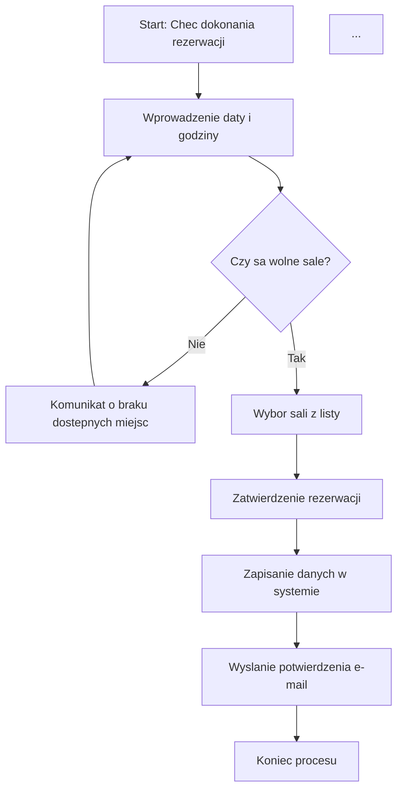

Projektowanie systemu – SmartRoom

Dokumentacja techniczna zawierająca diagramy UML, które opisują strukturę danych oraz logikę działania systemu rezerwacji sal.

1. Diagram Klas (Class Diagram)

```mermaid
classDiagram
    class Uzytkownik {
        +int id
        +string login
        +string email
        +string haslo
        +string rola
        +zaloguj()
    }

    class Sala {
        +int id
        +string numer
        +int pojemnosc
        +string wyposazenie
        +sprawdzDostepnosc()
    }

    class Rezerwacja {
        +int id
        +date data
        +time godzina_start
        +time godzina_koniec
        +string status
        +utworz()
        +anuluj()
    }
...
```

    Uzytkownik "1" --> "*" Rezerwacja : dokonuje
    Sala "1" --> "*" Rezerwacja : jest_przedmiotem

2. Diagram Sekwencji (Sequence Diagram)

Przedstawia proces interakcji studenta z systemem podczas wyszukiwania i rezerwacji sali w czasie rzeczywistym.

```mermaid
sequenceDiagram
    participant Student
    participant System
    participant BazaDanych

    Student->>System: Wyszukaj wolna sale
    System->>BazaDanych: Zapytanie o dostepne sale
    BazaDanych-->>System: Lista dostepnych sal
    System-->>Student: Wyswietlenie wynikow

    Student->>System: Wybor sali i rezerwacja
    System->>BazaDanych: Zapis nowej rezerwacji
    BazaDanych-->>System: Potwierdzenie zapisu
    System-->>Student: Rezerwacja zakonczona sukcesem
...
```

3. Diagram Aktywnosci (Activity Diagram)

Opisuje logikę biznesową procesu rezerwacji.

