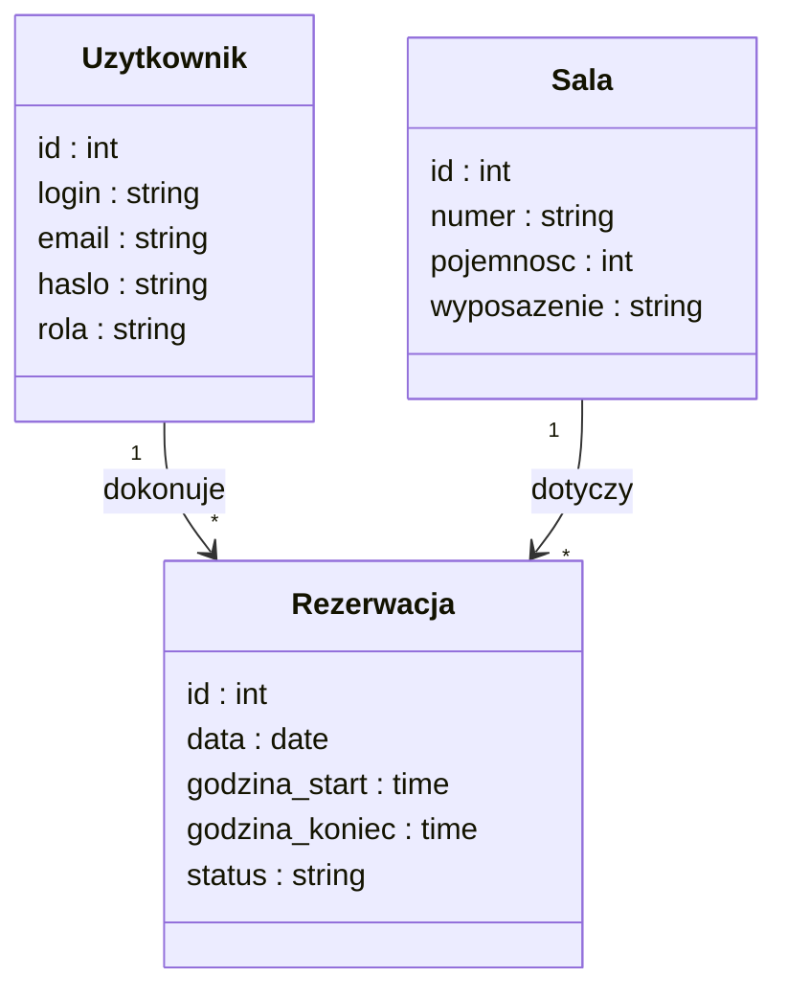
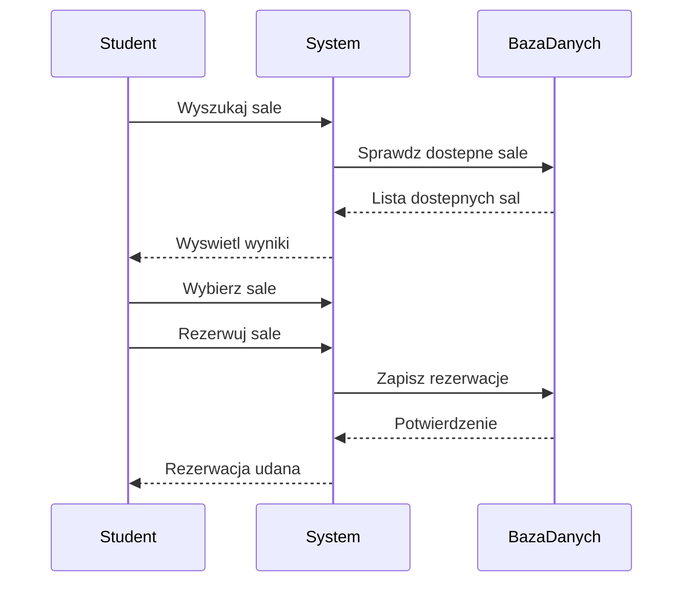
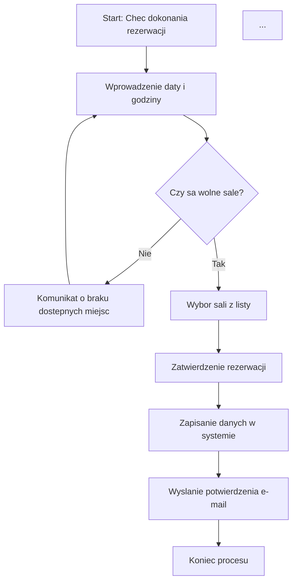

Projektowanie systemu – SmartRoom

Dokumentacja techniczna zawierająca diagramy UML, które opisują strukturę danych oraz logikę działania systemu rezerwacji sal.

## 1. Diagram Klas (Class Diagram)

## 2. Diagram Sekwencji (Sequence Diagram)

Przedstawia proces interakcji studenta z systemem podczas wyszukiwania i rezerwacji sali w czasie rzeczywistym.

3. Diagram Aktywnosci (Activity Diagram)

Opisuje logikę biznesową procesu rezerwacji.

