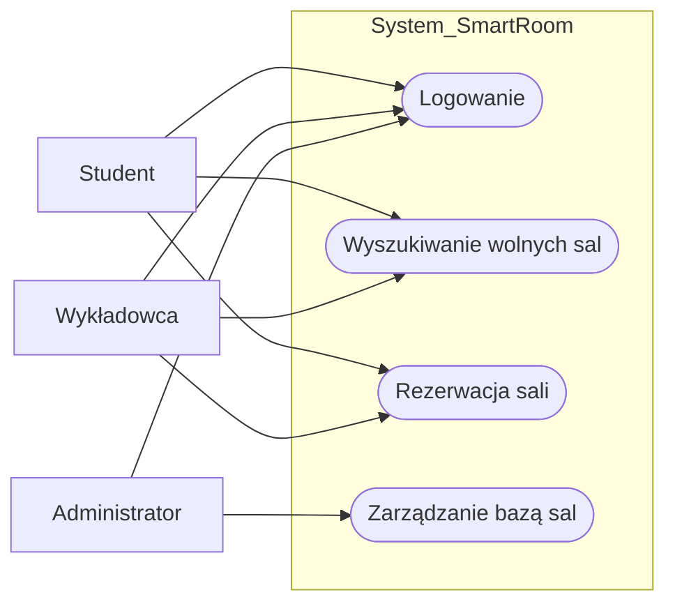

# Specyfikacja wymagań – System SmartRoom

## 1. Wymagania funkcjonalne
| ID | Opis wymagania | Priorytet |
|----|----------------|-----------|
| F1 | Użytkownik może zalogować się do systemu. | Must |
| F2 | Użytkownik może wyszukać wolną salę według daty i godziny. | Must |
| F3 | Użytkownik może dokonać rezerwacji wybranej sali. | Must |
| F4 | Administrator może zarządzać bazą sal (dodawanie/usuwanie). | Should |

## 2. Wymagania niefunkcjonalne
* **Wydajność:** Maksymalny czas odpowiedzi systemu do 3 sekund.
* **Bezpieczeństwo:** Szyfrowanie haseł użytkowników (SHA256).
* **Dostępność:** Interfejs responsywny (RWD) działający na urządzeniach mobilnych.

## 3. Diagram przypadków użycia (UML Use Case)

